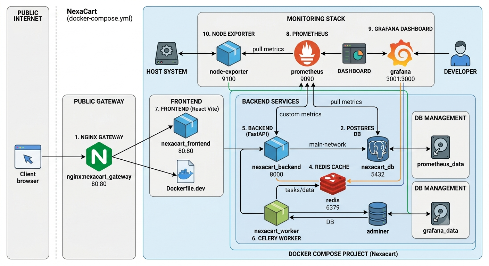

# NexaCart 🛒

NexaCart is a high-performance, containerized full-stack e-commerce platform engineered with a decoupled microservices architecture. The system is designed to simulate a secure, cloud-ready production environment by routing all external traffic through a centralized Nginx reverse proxy gateway and isolating internal service communication within a private Docker bridge network.

It features a fully integrated, production-grade observability and monitoring pipeline powered by Prometheus and Grafana.

---
<p align="center">
  
</p>
## 🏗️ Architecture Overview

The platform splits core responsibilities across specialized, single-purpose containers orchestrated via Docker Compose:

* **Reverse Proxy Gateway (`nginx`)**: The single public-facing entryway (Port 80). It handles SSL termination structures, eliminates CORS barriers, routes requests dynamically based on URL paths, and handles WebSocket connections.
* **Frontend UI (`react`)**: A highly optimized, statically compiled React application built with Vite, multi-stage built and served via an internal, lightweight Nginx Alpine container.
* **Core API (`fastapi`)**: A high-performance ASGI Python backend processing business logic, database queries, and token generation. Instrumented to expose native application and HTTP performance metrics.
* **Asynchronous Processing (`celery`)**: Background task workers acting completely independent of the main HTTP request/response lifecycles.
* **Message Broker & Cache (`redis`)**: Securely handles the Celery task queue distribution and acts as an ultra-fast, transient application data layer.
* **Relational Database (`postgresql`)**: Persistent, ACID-compliant relational storage utilizing isolated Docker volumes and granular health check loops.
* **Database Administration (`adminer`)**: A protected database management portal exposed on an isolated external port for configuration and inspection.
* **Observability Stack (`prometheus` & `grafana`)**: A specialized, automated pipeline that scrapes, stores, and visualizes real-time server infrastructure states and application-level software metrics.

---

## 📊 Observability & Monitoring Pipeline

To guarantee system high-availability and prevent blind spots, NexaCart deploys a modern telemetry stack:
* **FastAPI Instrumentation**: Automatically counts HTTP requests, tracks route-specific latency distributions, and logs 4xx/5xx error rates via `/metrics`.
* **Node Exporter**: A lightweight agent mapping physical host machine operating system kernels directly to metrics (CPU Core spikes, RAM saturation, Disk I/O bottlenecks).
* **Prometheus TSDB**: Actively scrapes targets every 15 seconds, indexing data points inside an optimized time-series database.
* **Grafana Visualization**: Transforms raw PromQL queries into beautiful, human-readable dashboards, maps, and predictive graphs.

---

## 🧭 Infrastructure Routing Table

By design, internal application layers (such as the raw FastAPI port, PostgreSQL, and Redis) are not exposed to the public internet, mitigating structural attack vectors. 

| Service Component | Internal Container Network URI | Public Gateway Address |
| :--- | :--- | :--- |
| **Storefront UI (React)** | `http://frontend:80` | 👉 [http://localhost/](http://localhost/) |
| **API Documentation (Swagger)** | `http://backend:8000/docs` | 👉 [http://localhost/docs](http://localhost/docs) |
| **Core REST Endpoints** | `http://backend:8000/api/v1/` | 👉 [http://localhost/api/v1/](http://localhost/api/v1/) |
| **Database Dashboard (Adminer)** | `http://adminer:8080` | 👉 [http://localhost:8080](http://localhost:8080) |
| **Prometheus Dashboard** | `http://prometheus:9090` | 👉 [http://localhost:9090](http://localhost:9090) |
| **Grafana Metrics UI** | `http://grafana:3000` | 👉 [http://localhost:3001](http://localhost:3001) |
| **Node Exporter Engine** | `http://node-exporter:9100/metrics` | _Internal Only (Isolated)_ |

---

## 🔐 Authentication & Data Security Patterns

NexaCart implements a strict stateless **OAuth2 Password Bearer flow with JSON Web Tokens (JWT)**.

* **Cryptographic Hashing**: User passwords are encrypted using **bcrypt** with a dynamically shifting work factor. Plaintext credentials are never saved, compared directly, or transmitted into system logs.
* **Stateless Sessions**: Upon validated login at `/api/v1/auth/login`, the API issues a signed HS256 JWT access token with a 30-minute expiration window.
* **Protected Route Resource Guarding**: Secure API routes use FastAPI dependency injection to parse request headers, validating incoming authorization metadata before resolving execution blocks:
    ```http
    Authorization: Bearer <json_web_token_string>
    ```

---

## 💾 Schema Evolution & Volume Persistence

To support iterative feature building without data degradation, database modifications are version-controlled via Alembic migrations acting as the "Git of data schemas."

### Applying Database Updates
When application models change or the environment is initialized for the first time:

1. **Auto-generate a structural migration delta script:**
   ```bash
   docker-compose run --rm backend alembic revision --autogenerate -m "describe_structural_changes"
   Review the Python script inside backend/alembic/versions/ to ensure structural accuracy.

Execute the delta upgrade cleanly against the live PostgreSQL container instance:

Bash
docker-compose run --rm backend alembic upgrade head
🚀 Local Development Orchestration
Prerequisites
Docker Desktop (Engine v20.10+ / Compose v2.0+)

Quickstart Execution Pipeline
Clone the repository and initialize the container layers:

Bash
docker-compose up -d --build
Execute pending database schema migrations:

Bash
docker-compose run --rm backend alembic upgrade head
Inspect orchestrator health matrices to confirm all systems are operating within valid baselines:

Bash
docker-compose ps
Follow real-time infrastructure event logging outputs:

Bash
docker-compose logs -f
📊 Configuring Grafana Dashboards
Access the Grafana UI via http://localhost:3001.

Authenticate using default credentials:

Username: admin

Password: admin (Update when prompted).

Link Prometheus Data Source:

Navigate to Connections -> Data Sources -> Add data source.

Choose Prometheus.

Define the internal target Connection URL as: http://prometheus:9090.

Scroll down and hit Save & test.

Import Production-Ready Dashboards:

Go to Dashboards -> New -> Import.

Paste Dashboard ID 11159 to instantly render the full FastAPI Performance Matrix.

Paste Dashboard ID 1860 to render the Node Exporter Linux Host Infrastructure dashboard.

🛠️ Infrastructure Troubleshooting Ledger
Diagnosing a 502 Bad Gateway Response
Cause: The Nginx Gateway container is functional, but the upstream application target container is refusing connections or running on an unmapped port configuration.

Fix: Stream the logs for that distinct upstream container via docker-compose logs frontend or backend. Ensure that for production-optimized builds, your nginx/default.conf upstream blocks map cleanly to the internal production ports (e.g., frontend:80) rather than old localized dev server ports (5173).

Diagnosing an Executable Not Found ($PATH) Error
Cause: Running database execution commands (such as alembic) directly inside a runtime instance before forcing Docker to install newly specified packages tracked in requirements.txt.

Fix: Force Docker to bypass image caches and rebuild your dependencies from absolute scratch:

Bash
docker-compose build --no-cache backend